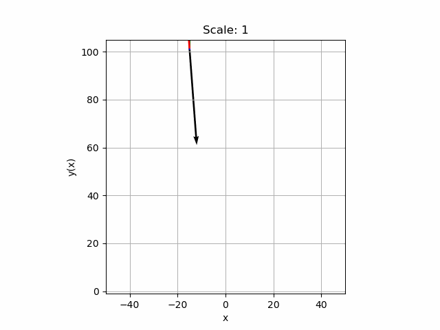
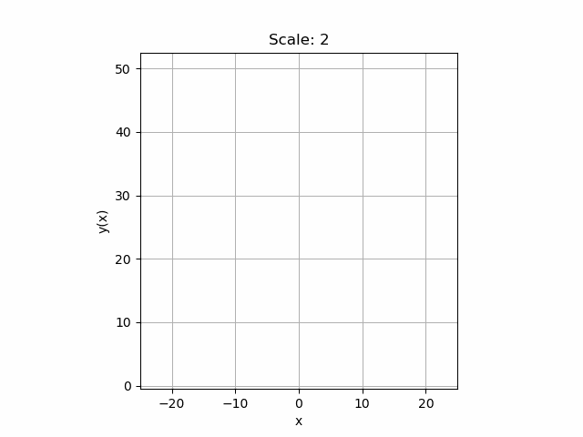
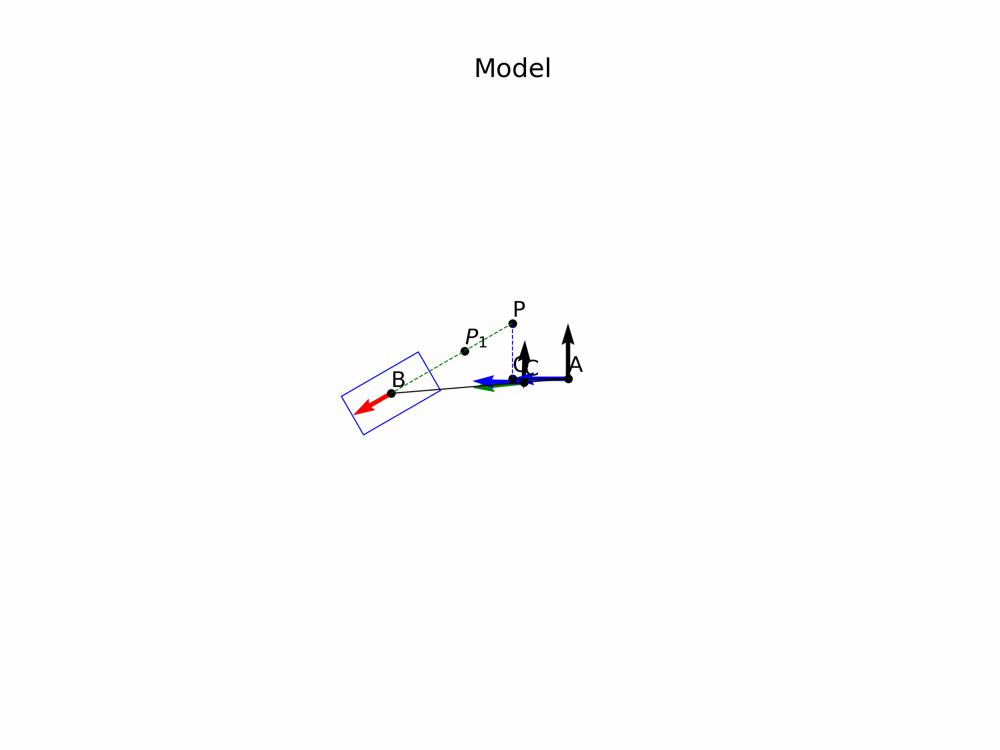
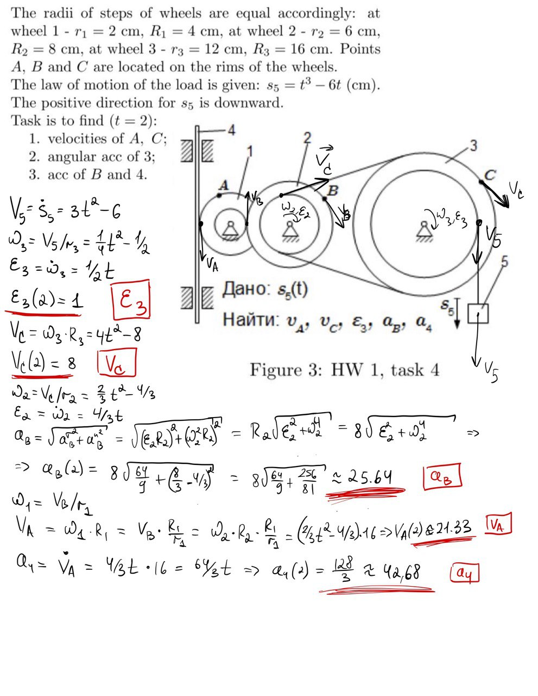

# Homework 1

**Author:** Igor Alentev

**Telegram:** [m8dotpie](https://t.me/m8dotpie)

**Email:** i.alentev@innopolis.university

## Stack:

The work is done within the single Jupyter Notebook. All the simulations were printed directly to the gif files. To replicate the result you should execute the [notebook](TMHW1.ipynb) and check generated files called "task1.gif" and "task2.gif".

- Python Notebooks
- python3
- numpy
- sympy
- ipympl
- matplotlib

## Table of Contents:
- [x] [Task 1](#task-1)
   - [Solution](#1.s)
   - [Visual Simulation](#1.si)
- [x] [Task 2](#task-2)
   - [Solution](#2.s)
     - [Geometrical Intuition](#2.s.1)
     - [Mechanics](#2.s.2)
   - [Visual Simulation](#2.si)
- [x] Task 3
   - [Handwritten Solution](#3.s)

# Task 1

## Solution 

Solution is pretty straightforward. We are given the parametric law which our point is following. As a result, if we differentiate this law component-vise once, then we get a velocity vector. If we differentiate the second time, we get a total acceleration. To find the tangential acceleration we can use the formula with the dot product. And finally, we can express the normal acceleration through the total and tangential. Formulas are shown below:

$$
\vec{O} = [3t, 4t^2 + 1]\\
\vec{V_O} = \frac{d\vec{O}}{dt}\\
\;\\
\vec{a_O} = \frac{d\vec{V}}{dt};\;
\vec{a^{\tau}_O} = \frac{\vec{a_O} \cdot \vec{V_O}}{\|\vec{V}\|}\\
\;\\
\vec{a^n_O} = \vec{a_O} - \vec{a^{\tau}_O}
$$

## Simulation 

### Vectors simulation
- **Black** vectors are velocities
- **Green** vectors are total accelerations
- **Red** vectors are tangential accelerations
- **Blue** vectors are normal accelerations 

# Task 2

## Solution 

### Geometrical intuition 

First of all we have to understand that locus of all positions of $A$ is a circle $\omega_1(O, OA)$. Let's consider point $P_1$ which is the second point of intersection of $PB$ with $\omega_1$. Since $\angle{OPA} = 60^{\circ}$ and $OP_1 = OP = 25$ we can conclude that $\angle{OP_1P} = 60^{\circ}$ and we have a equilateral triangle.

As a result, we can find $P_1$ as a rotation of $P$ on $60^{\circ}$ around $O$ pole. Moreover, we can construct the line $PB$ by points $P$ and $P_1$. Since we fixed $AB = 80$ and we know that $B$ lies on continuation of $PP_1$ we can determine $B$ as the intersection of the circle $\omega_2(A, AB)$ and the line $PP_1$.

More strictly $B = \omega_2 \cap PP_1$ where $P$ and $P_1$ are fixed and $\omega_2$ is a parametric circle dependent on the position of $A$.

Point $C$ can be simply expressed through the laws of motion of ends of the rod ($A$ and $B$) as we know the ratio in which $C$ divides the rod. ($20 : 60 = 1 : 3$)

Therefore, after all geometric analysis we arrive to the final equations.

$$
P = [0, 25]\\
P_1 = R_{60^{\circ}}(O, P)\\
A = OA \cdot [{\cos{t}, \sin{t}}]\\
B = \omega_2(A, AB) \cap PP_1\\
C = \frac{1}{4} \cdot (B - A) + A
$$

### Mechanics 

Since we know laws of motion of all the points of the system, we can very easilly find all velocities, tangent and normal accelerations. To do so we just need to differentiate the laws multiple times. Algorithm is completely the same for all the points so I will demonstate it on the example of point $B$.

$$
\vec{V_B} = \frac{d\vec{B}}{dt};\;\vec{a_B} = \frac{d\vec{V_B}}{dt}\\
\;\\
\vec{\tau_B} = \frac{\vec{V_B} \cdot \vec{V_B}}{\|\vec{V_B}\|};\;
\;\\
\vec{a_\tau} = \frac{\vec{a_B} \cdot \vec{V_B}}{\|\vec{V_B}\|}; \;
\vec{a_n} = \vec{a_B} - \vec{a_{\tau}}
$$

## Simulation 
### Vectors simulation
- **Black** vectors are velocities
- **Green** vectors are total accelerations
- **Red** vectors are tangential accelerations
- **Blue** vectors are normal accelerations

# Task 3

## Solution 

