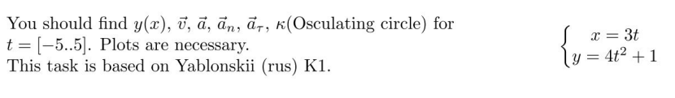
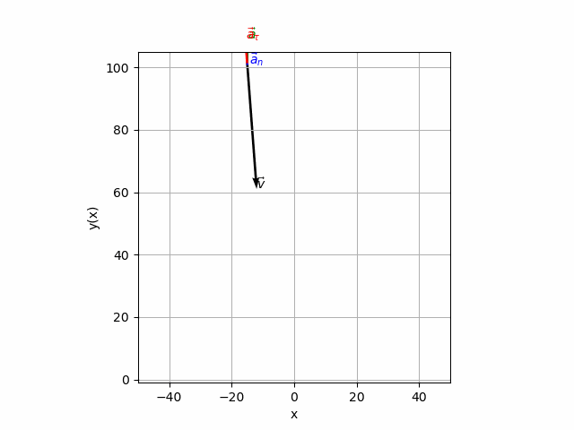
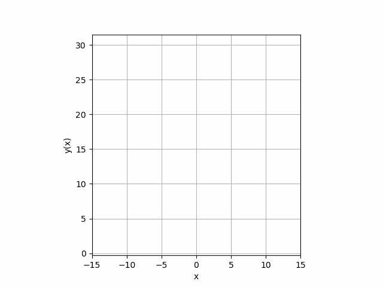

# Homework 1 Report

**Author:** Igor Alentev

**Telegram:** @m8dotpie

**Email:** i.alentev@innopolis.university

## Task 1

## Task 1 Solution

**Final result:**

Since we are given a parametric form of the curve, to find $y(x)$ we should get rid of the parameter (time). Firstly, we express $t = \frac{x}{3}$
