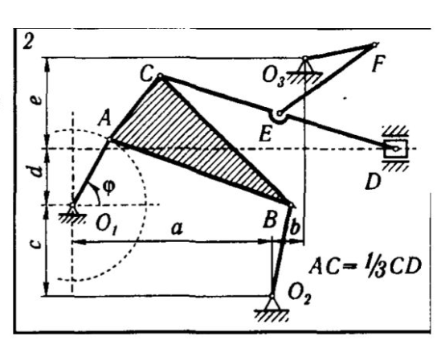
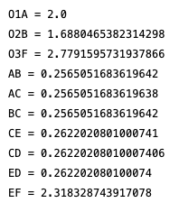
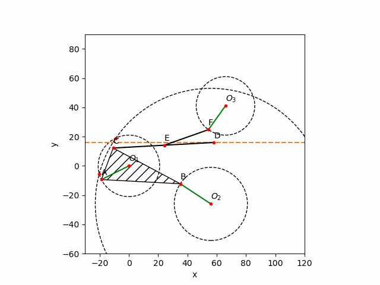
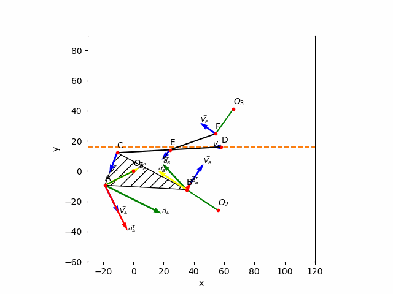
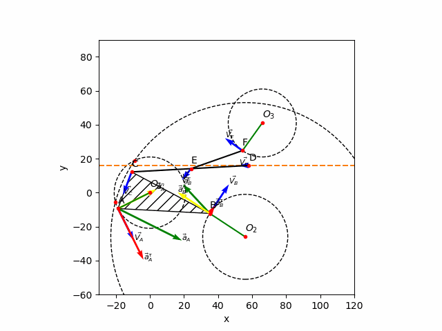
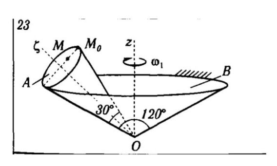
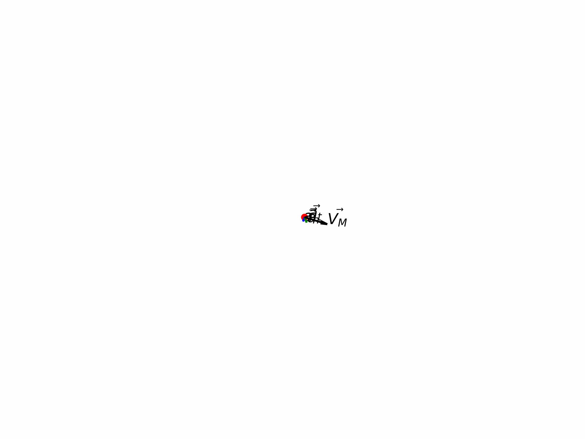

# Homework 2

**Author:** Igor Alentev

**Telegram:** [m8dotpie](https://t.me/m8dotpie)

**Email:** i.alentev@innopolis.university

## Stack:

The work is done within the single Jupyter Notebook. All the simulations were printed directly to the gif files. To replicate the result you should execute the [notebook](TMHW2.ipynb) and check generated files called "task1.gif" and "task2.gif".

- Python Notebooks
- python3
- numpy
- sympy
- ipympl
- matplotlib

## Table of Contents:
- [x] [Task 1](#task-1)
   - [Solution](#1.s)
     - [Geometrical Intuition](#1.s.1)
     - [Mechanics](#1.s.2)
       - [Velocities and Acceleration](#1.s.2.1)
       - [Angular Velocities](#1.s.2.2)
       - [Angular Accelerations](#1.s.2.3)
   - [Visual Simulation](#1.si)
     - [Construction Demo](#1.si.1)
     - [Vectors Model](#1.si.2)
     - [Complete Model](#1.si.3)
- [x] [Task 2](#task-2)
   - [Solution](#2.s)
     - [Mathematical Intuition](#2.s.1)
     - [Mechanics](#2.s.2)
     - [Main Trick](#2.s.3)
   - [Visual Simulation](#2.si)
     - [Model Simulation](#2.si.1)
     - [Vectors Evolution Simulation](#2.si.2)

# Task 1

## Solution 

## Geometrical Intuition 

We have to consider that $\phi$ cannot reach certain values as it will require the mechanism to break. Therefore, we have to calculate possible values of $\phi$. We have to notice, that the shortest distance between $O_2A$ cannot exceed $AB + O_2B$, otherwise there is no such $B$ that $AB = 54, O_2B=25$. Shortest distance $O_2A$ can be expressed through a right triangle with legs parallel to the axes. Therefore $({O_2A}_x)^2 + ({O_2A}_y)^2 \leq 79^2$. It is easy to see that it is simply the circle with the center at $O_2$ and a radius of $79$. Therefore extremum values are located at the points of intersection of circle $(O_1, O_1A)$ and $(O_2, AB + O_2B)$.

Now we can proceed with the $\phi$ constraints in mind. I propose to build the system starting from the point $A$, since we know the law for $A$ and we can restrict it with control of the angle $\phi$. Further on $(O, r)$ means the circle with the center at $O$ and radius $r$

- We can describe point $B$ as intersection of the circle $(A, AB)$ and the circle $(O_2, O_2B)$. 
- Next we can describe $C$ as intersection of $(A, AC)$ and $(B, BC)$. 
- Point $D$ can be described as intersection of the circle $(C, CD)$ with the line $y - d = 0$. 
- Point $E$ divides $CD$ in the known ratio, so there is no issues with finding it. 
- Finally $F$ is the intersection of $(E, EF)$ and $(O_3, O_3F)$

## Mechanics 

### **Velocities and Accelerations** 
Since $A$ was initially described parametrically of $\phi(t)$, we know time dependent laws of all points. Therefore velocity and acceleration can be easilly found be simple differentiation and expression through the known quantities.

### **Angular Velocities** 

Finding angular components is a bit more tricky. We can refer to the following formula:

$$\vec{V_A} = \vec{V_B} + \vec{V_{AB}} = \vec{V_B} + \vec{\omega_{AB}}\times\vec{r_{AB}}$$

In our particular case we can simplify expression to the following:

$$\frac{\|\vec{V_A} - \vec{V_B}\|}{r_{AB}} = \omega_{AB}$$

We can express evolution of angular velocity over time for any pair of points with this formula. Calculating according to the formula all the links at $t = 0$ yields the following result:

This result seems to be correct, since we are given $\omega_{AO_1} = 2$ and the formula did converge to this value. Moreover, links $AB, AC, BC$ have the same angular velocity, since it is the single solid body. Moreover $CE, CD, ED$ have the same angular velocity since they are different parts of the same link.

### **Angular Accelerations** 

Differentiating angular velocities acquired in previous step we can find angular acceleration of any link. For link $AB$ it is $\epsilon_{AB}(t=0) = −0.141119125335626$. In other words, the link is slowing down, which can be easilly seen on the animation.

## Visual Simulation 

### **Construction Demo** 

### **Vector Model** 

### **Complete Model** 

# Task 2

## Solution 

## Mathematical Intuition 
First of all let's define $R$ as a radius of the stationary cone and $r$ as radius of the rolling cone. Since base angle is $120^{\circ}$ we can derive that cone height is one half of the $OA$. Therefore we can find $R = \sqrt{OA^2 - (\frac{OA}{2})^2}$. To find $r$ we can use sine theorem of triangle. 
$$\frac{2r}{\sin{30}} = \frac{OA}{\sin{60}} \Rightarrow r = \frac{1}{2} OA \cdot \frac{\sin{30}}{\sin{60}}$$
Moreover, let's define $\sigma_1$ as arc length of $A$ on $B$. Let $\sigma_2$ be the arc length of the fixed point on $A$ during the roll. Obviously $\sigma_1 = \sigma_2$, since our motion is frictionless and without slipping. Therefore, further on I will omit the subfix and call the trajectory as $\sigma$.

## Mechanics 
We are given $\omega_1$ and $\epsilon_1$ at the moment $t=0$. Moreover, obviously $\phi(t=0) = 0$. Therefore we are free to integrate and find all the constants since we are given initial conditions. As a result:

$$
\dot{\omega_1} = \epsilon_1 \Rightarrow \omega_1 = \int{\epsilon_1}dt\\
\omega_1 = 3.7t + C;\; \omega_1(0) = 2 \Rightarrow C = 2\\
\dot{\phi_1} = \omega_1 \Rightarrow \phi_1 = \int{\omega_1}dt\\
\phi_1(t) = 1.85t^2 + 2t + C;\; \phi_1(0) = 0 \Rightarrow C = 0\\
\phi_1(t) = \frac{\sigma_1(t)}{R} \Rightarrow \sigma(t) = R \cdot \phi_1(t)
$$
Finally we acquire the following functions:
$$
\epsilon_1(t) = 3.7\\
\omega_1(t) = 3.7t + 2\\
\phi_1(t) = 1.85t^2 + 2t\\
\sigma(t) = (1.85t^2 + 2t) \cdot R
$$

Therefore, the answer for angular velocity and acceleration of cone $A$ is as follows:

$$
\phi_2(t) = \frac{\sigma(t)}{r} = (1.85t^2 + 2t) \cdot \frac{R}{r} \approx 6.2 t ^ 2 + 6.7t\\
\omega_2(t) = \dot{\phi_2} = (3.7t + 2)\frac{R}{r} \approx 12.4t + 6.7\\
\;\\
\epsilon_2(t) = \ddot{\phi_2} = 3.7\;\frac{R}{r} \approx 12.4
$$ 

## Main Trick 

Let $OO_2$ be the height of cone $A$. Since we know that $O_2$ is rotating around stationary $Z$ axis and has the law describing the angle $\phi_1(t)$, we can write the law for coordinates of $O_2$ in space depending on time. We have a right with equal legs, which can be easilly verified geometrically. Therefore radius of rotation is equal to $Z$ axis magnitute. As a result, we have the following coordinates:
$$
\vec{OO_2} = \frac{OO_2}{\sqrt{2}}
\left[\begin{array}{c} 
\sin{\phi_1}\\
\cos{\phi_1}\\
1
\end{array}\right]
$$
Furthermore, now we can find moving axes of the $A$ cone with cross products. Let's denote them as $n_1, n_2, n_3$ with $n_1$ codirectional with $OO_2$. We know that $M_0$ rotates around $O_2$ with the angle law for $\phi_2$. We can express $M_0$ in moving axes and project onto the stationary ones. Therefore the law for $M_0$:
$$
M_0 = 
\left[\begin{array}{c}
O_{2_x} + r \cdot \cos(\phi_2) \cdot n_{2_x} + r \cdot \sin(\phi_2) \cdot n_{3_x}\\
O_{2_y} + r \cdot \cos(\phi_2) \cdot n_{2_y} + r \cdot \sin(\phi_2) \cdot n_{3_y}\\
O_{2_z} + r \cdot \cos(\phi_2) \cdot n_{2_z} + r \cdot \sin(\phi_2) \cdot n_{3_z}
\end{array}\right]
$$
Finally, it is no problem to find the law for $M$, since this point lies on the segment $O_2M_0$ with the known relation. 
$$M = \frac{M_0M}{r} \cdot (O_2 - M_0) + M_0$$
Knowing the general law for the point $M$ we can differentiate it over time to find velocity, differentiate once again to find acceleration and use total acceleration and a velocity to derive tangential acceleration and normal acceleration.

## Visual Simulation 

### **Model** 

### **Vectors Evolution** 

