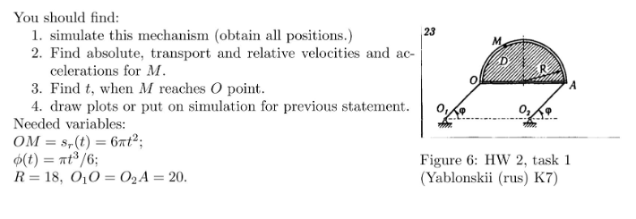
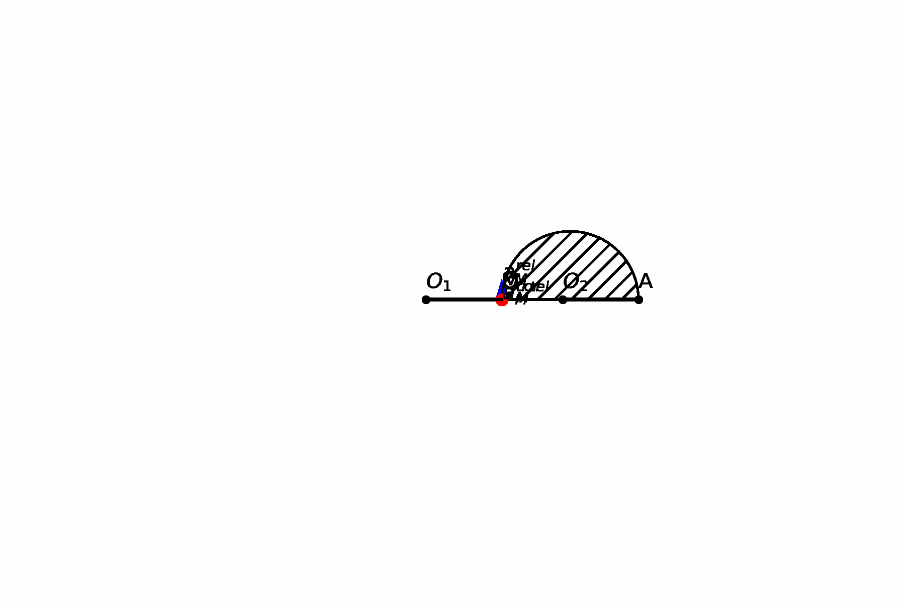
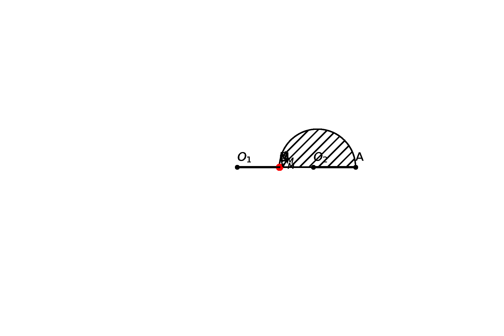
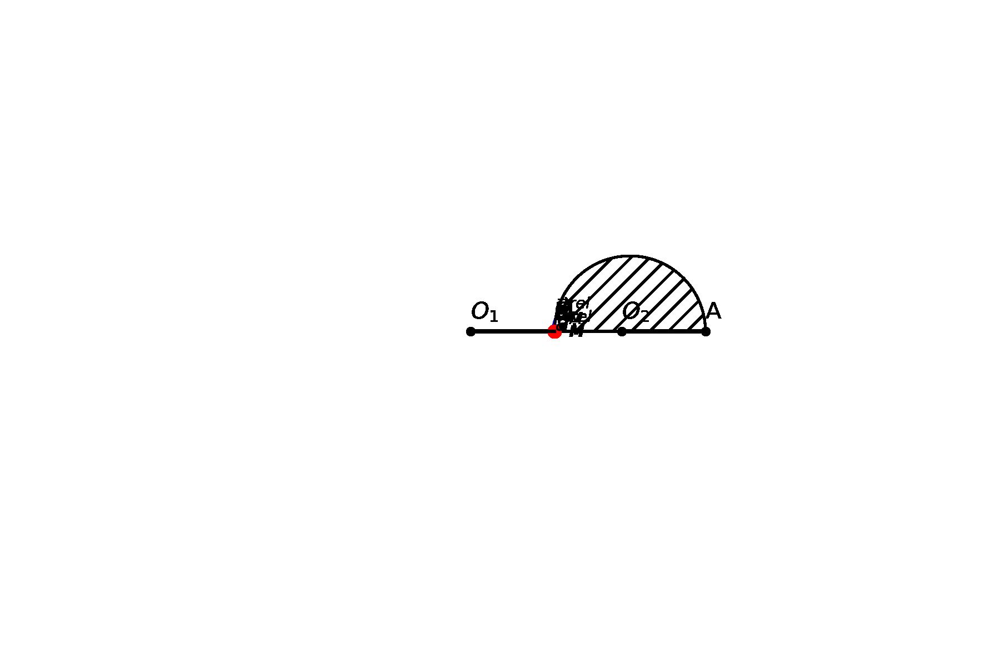
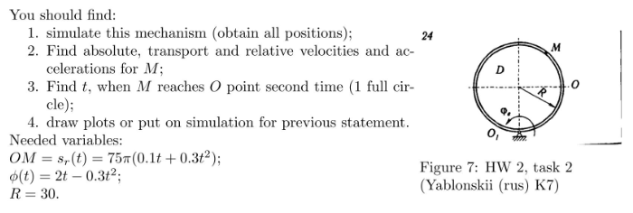
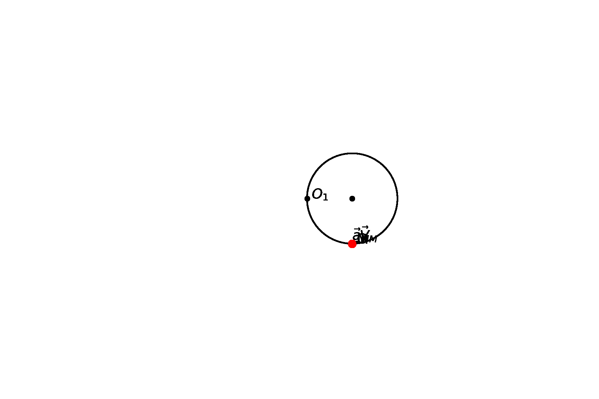
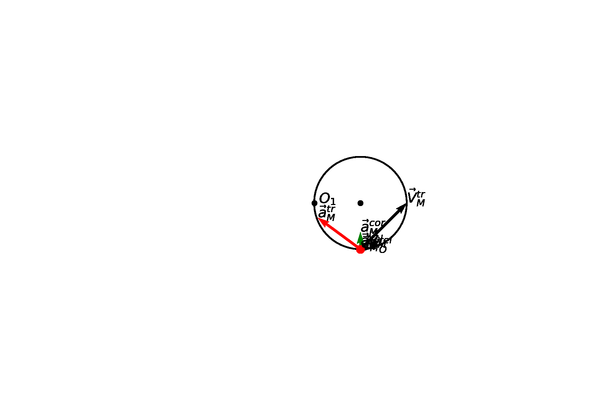

# Homework 2

**Author:** Igor Alentev

**Telegram:** [m8dotpie](https://t.me/m8dotpie)

**Email:** i.alentev@innopolis.university

## Stack:

The work is done within the single Jupyter Notebook. All the simulations were printed directly to the gif files. To replicate the result you should execute the [notebook](TMHW2.ipynb) and check generated files called "task1.gif" and "task2.gif".

This is the first homework when I finally started using custom class for simple and fast plotting.

- Python Notebooks
- python3
- numpy
- sympy
- ipympl
- matplotlib

## Table of Contents:
- [x] [Task 1](#task-1)
   - [Solution](#1.s)
      - [Geometrical Intuition](#1.s.1)
      - [$M$ reaches $A$](#1.s.2)
      - [Mechanical Intuition](#1.s.3)
   - [Visual Simulation](#1.si)
      - [Components graph](#1.si.1)
      - [Total graph](#1.si.2)
      - [Both graph](#1.si.3)
- [x] [Task 2](#task-2)
   - [Solution](#2.s)
   - [Visual Simulation](#2.si)
      - [Components graph](#2.si.1)
      - [Total graph](#3.si.2)
      - [Both graph](#2.si.3)

# Task 1

## Solution 

## Geometrical intuition 

This time the task does not contain any difficult steps in producing the simulation. Sinse $O_1O_2AO$ is parallelogram we can easilly find coordinates of all points. Given that $O_1$ is the origin, we know that $O_2$ is $2R$ on axis $x$. We know that $O$ is rotating around the origin, therefore $A$ is $O$ translated on $x$ axis by $2R$. $M$ is rotating on circumference of the semicircle with origin at $\frac{O + A}{2}$ with the known law of arc length.

## Time when $M$ reaches $O$ 
Angle for the $M$ during it's movement can be calculated as follows:

$$\phi_2 = \frac{s_r}{R}$$

Therefore we have to solve equation $\phi_2 = \pi$. The answer is: $t_r \approx 1.732$

## Mechanical intuition 

We can split the task on the two parts.

### First part (for $t < t_r$)

Point $M$ did not reach point $A$. Then we can easilly calculate relative, transport velocity, relative, corealis and transport accelerations. During my simulation I have taken point $O_s = \frac{O + A}{2}$ as a pole for $M$. It is beneficial since we know that $O_s$ is rotating with the same angle law as the $O$ and $A$ and it is the only motion. Moreover, the distance $O_sM$ is simply the radius $R$. We can easilly derive $\omega_1, \epsilon_1$ from $\phi(t)$ and $\omega_2, \epsilon_2$ from $s_r(t)$, therefore:

$$
\vec{V}_{O_s} = \vec{\omega}_1 \times \frac{\vec{O}_1 + \vec{O}_2}{2}
$$

$$
\vec{V_M^{tr}} = \vec{V_{O_s}} + \vec{\omega}_1 \times (\vec{M} - \vec{O}_s)
$$

$$
V_M^{rel} = 
\left[\begin{array}{c} 
\dot{x}_M\\
\dot{y}_M\\
0
\end{array}\right]
$$

$$
\vec{a_M^{tr}} = \dot{\vec{V_{O_s}}} + \vec{\epsilon_1} \times  (\vec{M} - \vec{O}_s) + \vec{\omega_1} \times (\vec{\omega_1} \times (\vec{M} - \vec{O}_s))
$$

$$
\vec{a_M^{cor}} = 2 \cdot \vec{\omega_1}  \times \vec{V_M^{rel}}
$$

$$
\vec{a_M^{rel}} = 
\left[\begin{array}{c}
\ddot{x_M}\\
\ddot{y_M}\\
0
\end{array}\right]
$$

### Second part (for $t \ge t_r$)

In the second part point $M$ reaches $A$ and therefore it has no relative components in velocity and acceleration. As a result there is no relative velocity, coreolis and relative acceleration. Moreover, transport velocity and acceleration is absolutely the same as $O_s$. 

## Visual Simulation 

### Components graph 

### Total graph 

### Both 

# Task 2

## Solution 

This task is relatively simple to simulate as well. Stationary coordinate system origin is at $O_1$. Moving system is at the center of the circle $O_2$. Therefore, we can simply express all the points in the stationary coordinate system. Let's take $O_2$ as the pole for the $M$ as this pole has only rotational movement. If we fix $O_2$ then $M$ is rotating around $O_2$ with a known arc length law.

$$
\vec{V}_{O_2} = \vec{\omega}_1 \times \vec{R_{O_2}}
$$

$$
\vec{V_M^{tr}} = \vec{V_{O_2}} + \vec{\omega}_1 \times (\vec{M} - \vec{O}_2)
$$

$$
V_M^{rel} = 
\left[\begin{array}{c} 
\dot{x}_M\\
\dot{y}_M\\
0
\end{array}\right]
$$

$$
\vec{a_M^{tr}} = \dot{\vec{V_{O_2}}} + \vec{\epsilon_1} \times  (\vec{M} - \vec{O}_s) + \vec{\omega_1} \times (\vec{\omega_1} \times (\vec{M} - \vec{O}_2))
$$

$$
\vec{a_M^{cor}} = 2 \cdot \vec{\omega_1}  \times \vec{V_M^{rel}}
$$

$$
\vec{a_M^{rel}} = 
\left[\begin{array}{c}
\ddot{x_M}\\
\ddot{y_M}\\
0
\end{array}\right]
$$

## Visual Simulation 

### Components graph 

### Total graph 

### Both 

