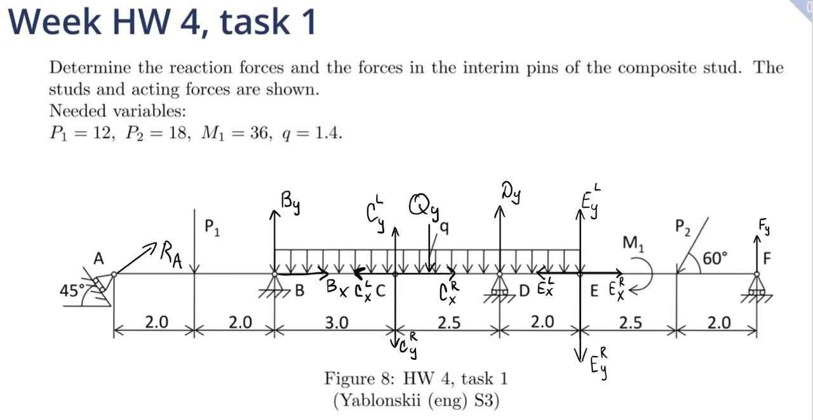
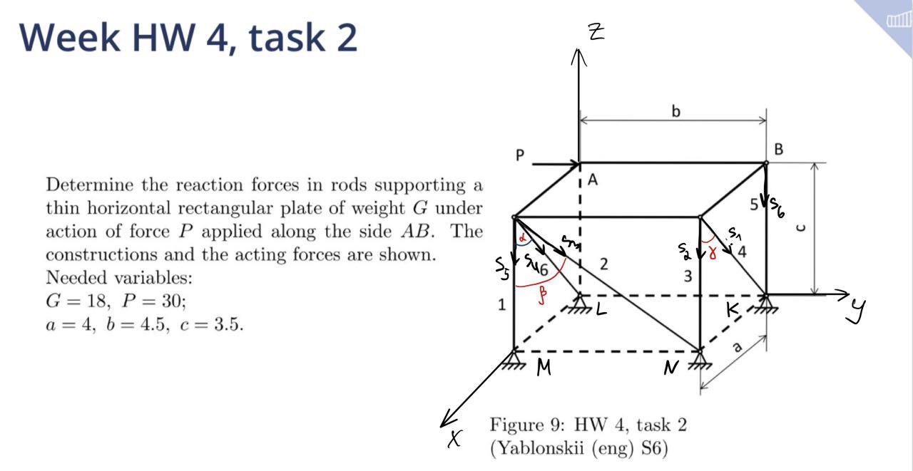

# Homework 4

**Author:** Igor Alentev

**Telegram:** [m8dotpie](https://t.me/m8dotpie)

**Email:** i.alentev@innopolis.university

## Table of Contents
- [x] [Task 1](#task-1)
- [x] [Task 2](#task-2)

# Task 1

### **Research object:**

Three bodies system: Rods $AC$, $CE$, $EF$

System is in equilibrium $\Rightarrow$ static analysis.

### **Force analysis:**

Forces are drawn on the image above. $X$ axis is directed to the right. $Y$ axis is directed upwards.

Unknowns (three bodies):

$$R_A = ?, B_Y = ?, B_X = ?, C_X^L = ?, C_Y^L = ?$$

$$C_X^R = ?, C_Y^R = ?, D_Y = ?, E_X^L = ?, E_Y^L = ?$$

$$E_X^R = ?, E_Y^R = ?, F_Y =?$$

Given:

$$P_1, Q_Y = 7.5q, M_1, P_2$$

### **Solution:**

Body $AC$:

$$x: R_A\cos{45} + B_X - C_X^L = 0$$

$$y: R_A\sin{45} + B_Y + - P_1 + C_Y^L = 0$$

$$M_A: 4B_Y + 7C_Y^L - 2P_1 = 0$$

Body $CE$:

$$x: C_X^R - E_X^L = 0$$

$$y: -Q_Y - C_Y^R + E_Y^L + D_Y = 0$$

$$M_C: 2.5 D_Y + 4.5 E_Y^L - 0.75 Q_Y$$

Body $EF$:

$$x: E_X^R - P_2\cos{60}$$

$$y: -E_Y^R - P_2\sin{60} + F_Y$$

$$M_E: -M_1 - 2.5 P_2\sin{60} + 4.5 F_Y$$

There are 9 uknowns and 9 equations. From last to first we acquire $F_Y, E_Y^R=-E_Y^L, E_X^R=-E_X^L$ for first body, $C_X^R=-C_X^L, C_Y^R=-C_Y^L, D_Y$ for second body and $B_X, A_Y, B_Y$ from the first body.

# Task 2

###

### **Research object:**

One body in equilibrium $\Rightarrow$ static analysis.

### **Force analysis:**

We have ideal rods $\Rightarrow$ reaction is parallel to rod itself. Initial directions **(all except weight which is directred downwards from the center of the plate)** and coordinate system shown on the image above. Angles are defined on the picture as well. Since we know all dimensions of this figure, we can assume we know all the angles. For convinience I will stick to symbolic representation.

Unknowns:

$$S_i, i = 1,...,6$$

Given:

$$G, P$$

### **Solution:**

$$x:-S_1\sin{\gamma} - S_4\sin{\alpha} = 0$$

$$y: P + S_3\sin{\beta} = 0$$

$$z: -G - S_2 - S_3\cos{\beta} - S_4\cos{\alpha} - S_5 - S_6 = 0$$

$$M_x: -\frac{b}{2} G - bS_1\cos{\gamma} - b S_2 - cS_3\sin{\beta} - bS_6 = 0$$

$$M_y: aS_1\cos{\gamma} + aS_2 + aS_3\cos{\beta} + aS_5 + \frac{a}{2}G = 0$$

$$M_z: bS_1\sin{\gamma} + aS_3\sin{\beta} = 0$$

In the same manner we acquire a system of 6 linearly independent equations and 6 unknowns which can be found from those equations.
