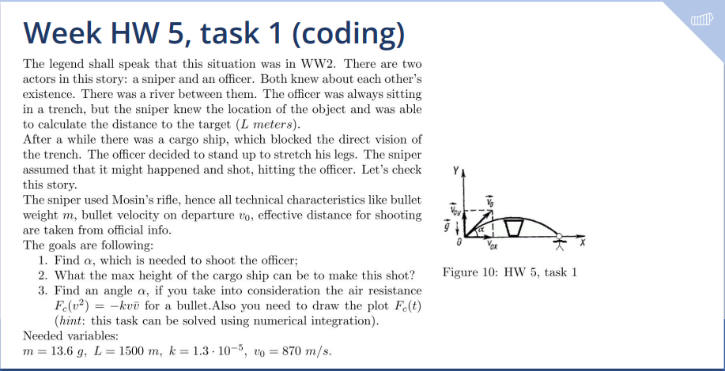
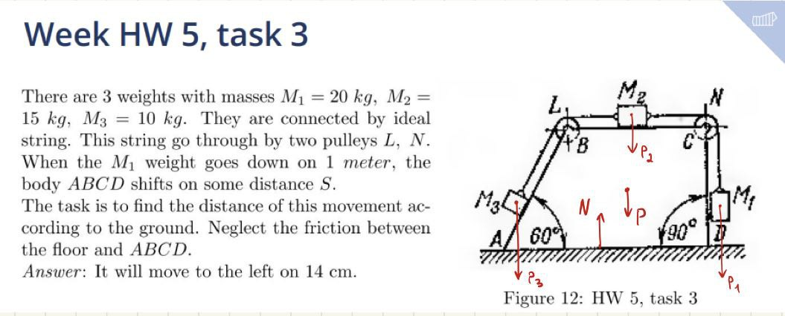

# Homework 3

**Author:** Igor Alentev

**Telegram:** [m8dotpie](https://t.me/m8dotpie)

**Email:** i.alentev@innopolis.university

## Table of Contents
- [x] [Task 1](#task-1)
- [x] [Task 2](#task-2)
- [x] [Task 3](#task-3)
  - [Research Object](#3.ro) 
  - [Solution Method](#3.me)
  - [Force Analysis](#3.fa)
  - [Solution](#3.s)
  - [Answer](#3.a)

# Task 1

# Task 2

# Task 3

`Additional statement: Mass of the ABCD body is M = 100kg.`

## Research Object: 
System of 4 bodies and 2 pulleys with an ideal string.

## Method: 
Mass geometry and Center of mass analysis.

## Force analysis: 

$P_1, P_2, P_3$ - weights of bodies attached to the string.

$N$ - reaction of the floor

$P$ - weight of the $ABCD$ body

## Solution: 

$$m \vec{a} = \sum{\vec{F}} = \vec{P_1} + \vec{P_2} + \vec{P_3} + \vec{P} + \vec{N}$$

$$m\ddot{x_c} = 0$$

$$m\dot{x_c} = C_0 = 0 \Rightarrow C_0 = 0$$

$$mx_c = C_1 = 0 \Rightarrow C_1 = 0$$

Therefore, center of mass displacement is zero, then we can apply the analysis of center of mass.

|     | Initial | Final |
|-----|---------|-------|
| $x_{c_1}$ | 0       |  $x_{c_1} - \Delta{S}$ |
| $x_{c_2}$ | 0       |  $x_{c_2} - \Delta{S} + \Delta{x_{c_2}}$ |

Where $\Delta{x_{c_2}}$ is the displacement of the center of mass of the system of bodies $1, 2, 3$ relative to the object $ABCD$.

Let's fix the body $ABCD$ in place and calculate the displacement of the center of mass of the bodies $1, 2, 3$ realtive to it.

$$x_{c_2} = \frac{M_1x_1 + M_2x_2 + M_3x_3}{M_1 + M_2 + M_3}$$

$$x_{c_2} + \Delta{x_{c_2}} = \frac{M_1x_1 + M_2(x_2 + 1) + M_3(x_3 + \cos{60})}{M_1 + M_2 + M_3}$$

$$\Rightarrow \Delta{x_{c_2}} = \frac{M_2 + M_3\cos{60}}{M_1 + M_2 + M_3}$$

Finally, we can write analysis of the center of mass of the whole system. Let $M_1 + M_2 + M_3 = m_2$ and the mass of $ABCD$ be $m_1$, then:

$$x_c = \frac{m_1x_1 + m_2x_2}{m_1 + m_2} = \frac{m_1(x_1 - \Delta{S}) + m_2(x_2 - \Delta{S} + \Delta{x_{c_2}})}{m_1 + m_2}$$

$$\Delta{S} = \frac{m_2\Delta{x_{c_2}}}{m_1 + m_2}$$

## Answer 

$$\Delta{S} = 0.137m \approx 14cm$$

Since we guessed the right sign of the movement, we can conclude that the final displacement of the system was $14cm$ to the left.

