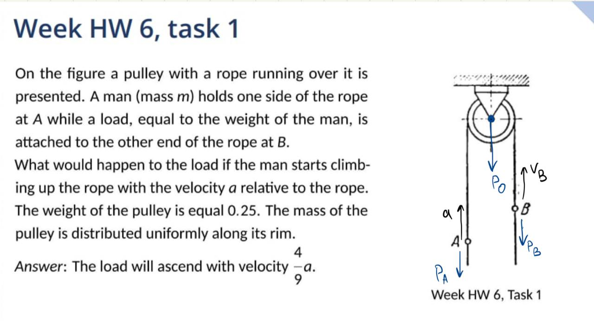
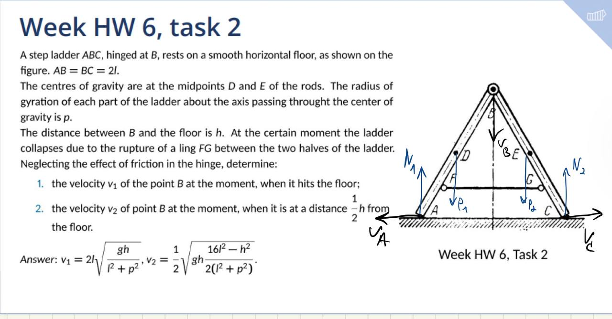
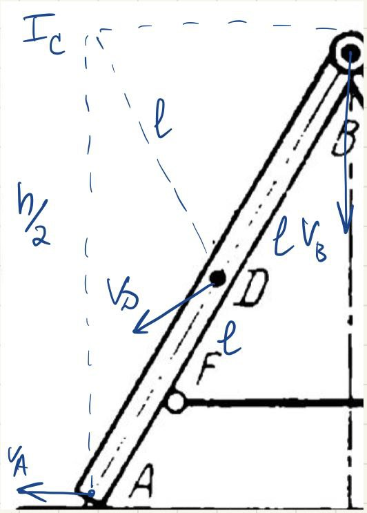

# Homework 6

**Author:** Igor Alentev

**Telegram:** [m8dotpie](https://t.me/m8dotpie)

**Email:** i.alentev@innopolis.university

## Table of Contents

- [x] Task 1
  - [Research object](#1.ro)
  - [Method](#1.me)
  - [Conditions](#1.co)
  - [Force analysis](#1.fa)
  - [Solution](#1.so)
- [x] Task 2
  - [Research object](#2.ro)
  - [Method](#2.me)
  - [Conditions](#2.co)
  - [Force analysis](#2.fa)
  - [Solution](#2.so)
    - [Half way down](#half-way-down)
    - [On the floor](#on-the-floor)

# Task 1

## Research object 

A system of three bodies - pulley, weight A and weight B.

## Method 

Change of angular momentum

## Conditions 

| I | II |
|---|----|
| V = 0 | V_A |
| a = 0 | V_B - ? |

## Force analysis 

$P_A, P_B, P_{p}$

## Solution 

Let's consider center of pulley as the reference point $O$.

$$\frac{dL}{dt} = \sum M_O(\vec{F^E}) = M_O(\vec{P_A}) + M_O(\vec{P_B}) + M_O(\vec{P_O}) + M_O(\vec{N}) = 0$$

$$L_{II} = L_A + L_B + L_C$$

$$L_A = m(V_A + V_B)r, L_B = m V_B r, L_O = J_O \omega = \frac{1}{4}mr^2\omega$$

Since we want to find the linear velocity of $B$, we can express angular components from the linear one. 

$$\omega = \frac{V_B}{r} \Rightarrow L_O = \frac{mr}{4} V_B$$

Since the change of the angular momentum is zero, then initial and final angular momentum are equal to each other. $L_{I} = L_{II}$ (for conditions). Since initial angular momentum was zero, then the final is zero as well.

$$L_{II} = m(V_A + V_B)r + m V_B r + \frac{mr}{4} V_B = 0 \Rightarrow V_B = -\frac{4}{9} V_A$$

Since we got a negative relation, then the load will approach the man (ascend).

# Task 2

All the forces we have in our system are conservative (gravitational).

## Research object 

A system of two rods with a joint.

## Method 

Change in kinetic energy of the system.

## Conditions 

| I | II | III|
|---|----|----|
| h | h / 2 | 0 |
| V = 0 | V_B - ? | V_B = ? |

## Force analysis 

$P_1, P_2, N_1, N_2$

## Solution 

Having three system states:

1. Initial
2. B travels half-way
3. B is on the ground

We can analyse potential forces and find the velocity.

System is conservative and does not loose energy. Therefore:

$$T_1 + \Pi_1 = T_2 + \Pi_2 = T_3 + \Pi_3$$

Since the ladder is completely symmetrical, we will analyse energy of one half of the ladder and double it.

$$\Pi_1 = mgh, \Pi_2 = \frac{1}{2}mgh, \Pi_3 = 0$$

### Half way down

$$T_1 = 0$$

$$T_2 = T_1 + \Pi_1 - \Pi_2 = 0 + mgh - \frac{1}{2}mgh = mV^2_{D_2} + J\omega^2 =$$

$$= m\omega^2 l^2 + m\omega^2\rho^2 \Rightarrow$$

$$\Rightarrow \omega = \sqrt{\frac{1}{2} gh \frac{1}{l^2 + \rho^2}} = \sqrt{gh \frac{1}{2(l^2 + \rho^2)}}$$

To find $V^1_B$ we can use IC method. Specifically, we know that the rod is rotating around some IC, which we can find since we know directions of velocities of $B$ and $A$ for example. Therefore, we need some geometry, to analyse the relations between linear and angular velocities.

$$\Rightarrow V_{B_2} = \omega \cdot \sqrt{4l^2 - \frac{h^2}{4}} = \sqrt{\frac{1}{2} gh \frac{1}{l^2 + \rho^2}} = \sqrt{gh \frac{4l^2 - \frac{h^2}{4}}{2l^2 + 2\rho^2}} = \frac{1}{2}\sqrt{gh \frac{16l^2 - h^2}{2(l^2 + \rho^2)}}$$

### On the floor

On the floor potential energy is equal to zero, so the same equation holds for the kinetic energy and we can express the angular velocity the very same way.

$$T_3 = T_1 + \Pi_1 = mgh = mV^2_D  + J\omega^2 = ml^2\omega^2 + m\rho^2\omega^2 \Rightarrow \omega = \sqrt{\frac{gh}{l^2 + \rho^2}}$$

$$\Rightarrow V_{B_3} = 2l\omega = 2l \sqrt{\frac{gh}{l^2 + \rho^2}}$$

