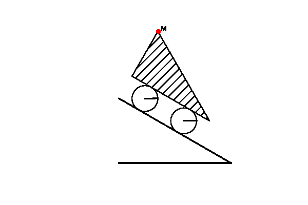

# theormech.hw
Theoretical Mechanics Homework repository

- [theormech.hw](#theormechhw)
- [Weekly Homeworks](#weekly-homeworks)
  - [Weekly Homeworks Figures](#weekly-homeworks-figures)
- [Big Research Homeworks](#big-research-homeworks)
  - [Research Homework 1](#research-homework-1)
  - [Research Homework 2](#research-homework-2)

# Weekly Homeworks
- [Homework 1](HW1/README.md) (figure 1)
- [Homework 2](HW2/README.md) (figure 2)
- [Homework 3](HW3/README.md) (figure 3)
- [Homework 4](HW4/README.md)
- [Homework 5](HW5/README.md) (figure 4)
- [Homework 6](HW6/README.md)
- [Homework 7](HW7/README.md) (figure 5)

## Weekly Homeworks Figures

# Big Research Homeworks

## Research Homework 1

Given trajectory execution with a physical constrainsts on the car. The task is to find the optimal velocity and acceleration profile for the car to execute the trajectory.

**Trajectory Execution simulation:**

## Research Homework 2

Deriving dynamical model for YoYo, comparing with other solutions and testing predictions on real-life experiments.

[Group Report](https://lvjonok.github.io/f22-theoretical-mechanics/research2/Research%20Homework%202.html)
